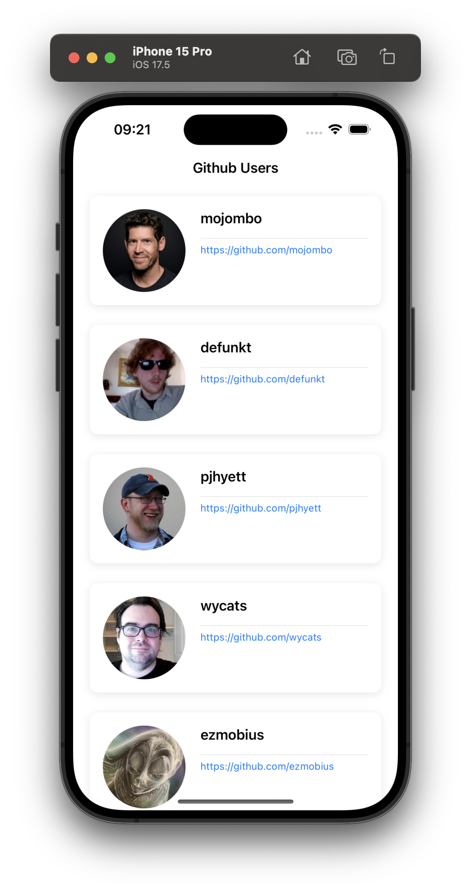

# GitHub Users

The application allows administrators to browse all members of a GitHub-like platform and access detailed user profiles.

# Acceptance Criteria

- The administrator can look through fetched users’ information.
- The administrator can scroll down to see more users’ information with 20 items per fetch.
- Users’ information must be shown immediately when the administrator launches the application for the second time.
- Clicking on an item will navigate to the page of user details.

# Getting started

1. Make sure you have the Xcode version 15.0 or above installed on your computer. 
2. Download the project files from the repository. 
3. Open the project file in Xcode. 
4. Review the code and make sure you understand what it does. 
5. Run the active scheme. 

# Screenshot

  
  

# Dependencies

Use Xcode to manage the versions of package dependencies and make sure your project has the most up-to-date code changes.
List of dependencies:

- Alamofire is an HTTP networking library written in Swift.
- Factory is a new approach to Container-Based Dependency Injection for Swift and SwiftUI.
- ObjectMapper is a framework written in Swift that makes it easy for you to convert your model objects (classes and structs) to and from JSON.
- ProgressHUD is a convenient and intuitive HUD tool designed specifically for iOS.
- Stinsen offers a simple, powerful, and elegant implementation of the Coordinator pattern in SwiftUI, ensuring seamless functionality across iOS, tvOS, watchOS, and macOS devices.
- SwiftMessages is a very flexible view and view controller presentation library for UIKit and SwiftUI.
- CachedAsyncImage is AsyncImage, but with cache capabilities.
